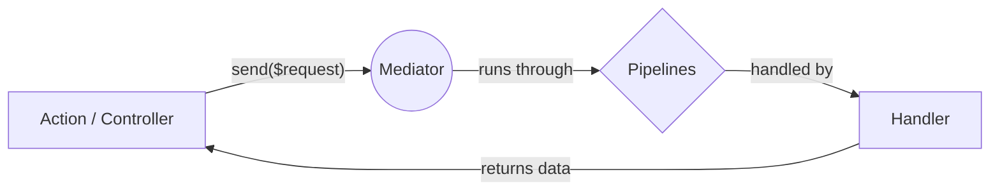
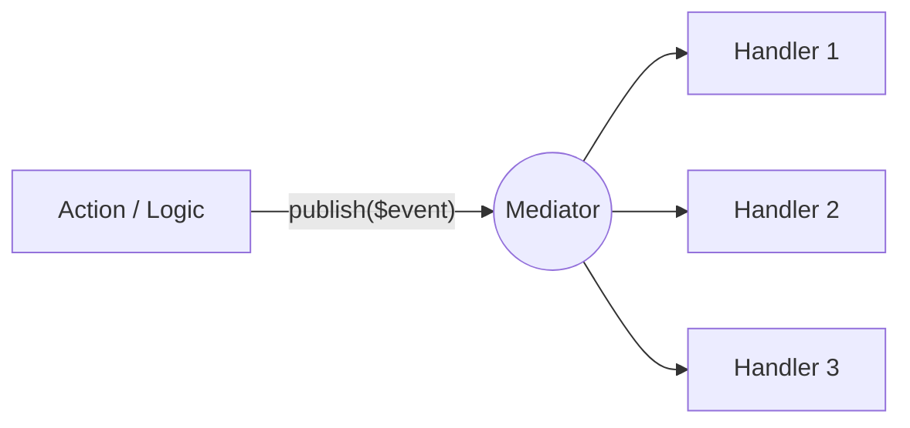

[](https://github.com/ignaciocastro0713/cqbus-mediator/actions/workflows/run-tests.yml)
[](https://github.com/ignaciocastro0713/cqbus-mediator/actions/workflows/phpstan.yml)
[](https://codecov.io/gh/ignaciocastro0713/cqbus-mediator)
[](https://ignaciocastro0713.github.io/cqbus-mediator/)
<a href="https://packagist.org/packages/ignaciocastro0713/cqbus-mediator" target="_blank"></a>
<a href="https://packagist.org/packages/ignaciocastro0713/cqbus-mediator" target="_blank"></a>
<a href="https://packagist.org/packages/ignaciocastro0713/cqbus-mediator" target="_blank"></a>

**CQBus Mediator** is a modern, zero-configuration Command/Query Bus for Laravel. It simplifies your application architecture by decoupling controllers from business logic using the Mediator pattern (CQRS), PHP 8 Attributes, and elegant routing pipelines.

---

## 🪝 The Problem it Solves

### ❌ Before (The Fat Controller)
Bloated, hard to test, and mixes HTTP logic with business logic and side effects.

```php
class UserController extends Controller
{
    public function register(Request $request)
    {
        $request->validate(['email' => 'required|email', 'password' => 'required']);
        
        DB::beginTransaction();
        try {
            $user = User::create($request->all());
            Mail::to($user)->send(new WelcomeEmail());
            Log::info("User registered");
            DB::commit();
            return response()->json($user, 201);
        } catch (\Exception $e) {
            DB::rollBack();
            throw $e;
        }
    }
}
```

### ✅ After (CQBus Mediator + Attributes)
Clean, modular, heavily decoupled, and 100% testable.

```php
use Ignaciocastro0713\CqbusMediator\Attributes\Routing\Api;
use Ignaciocastro0713\CqbusMediator\Attributes\Pipelines\Pipeline;

#[Api]
#[Pipeline(DatabaseTransactionPipeline::class)] // Handles DB Transactions automatically
class RegisterUserAction
{
    use AsAction;

    public function __construct(private readonly Mediator $mediator) {}

    public static function route(Router $router): void
    {
        $router->post('/register'); // Route lives with the action
    }

    public function handle(RegisterUserRequest $request): JsonResponse
    {
        // 1. Validation happens automatically in FormRequest
        // 2. Logic is executed by the decoupled Handler
        $user = $this->mediator->send($request); 
        
        // 3. Side effects (Emails, Logs) are broadcasted to Notifications
        $this->mediator->publish(new UserRegisteredEvent($user)); 
        
        return response()->json($user, 201);
    }
}
```

---

## 📚 Official Documentation

For comprehensive guides, API references, and advanced usage examples, please visit our official documentation site.

👉 **[Read the CQBus Mediator Documentation](https://ignaciocastro0713.github.io/cqbus-mediator/)**

---

## 📑 Table of Contents
- [✨ Why use this package?](#-why-use-this-package)
- [🚀 Installation](#-installation)
- [🧠 Core Concepts](#-core-concepts)
- [⚡ Quick Start (Command/Query)](#-quick-start-commandquery)
- [📢 Event Bus (Publish/Subscribe)](#-event-bus-publishsubscribe)
- [🎮 Routing & Actions](#-routing--actions)
- [🔗 Pipelines (Middleware)](#-pipelines-middleware)
- [🧪 Testing Fakes](#-testing-fakes)
- [📋 Console Commands](#-console-commands)
- [🚀 Production & Performance](#-production--performance)
- [🛠️ Development](#️-development)

---

## ✨ Why use this package?

- **⚡ Zero Config**: Automatically discovers Handlers and Events using PHP Attributes (`#[RequestHandler]`, `#[Notification]`).
- **📢 Dual Pattern Support**: Seamlessly handle both **Command/Query** (one-to-one) and **Event Bus** (one-to-many) patterns.
- **🛠️ Scaffolding**: Artisan commands to generate Requests, Handlers, Events, and Actions instantly.
- **🔗 Flexible Pipelines**: Apply middleware-like logic globally or specifically to handlers using the `#[Pipeline]` attribute.
- **🎮 Attribute Routing**: Manage routes, prefixes, and middleware directly in your Action classes—no more bloated route files.
- **🚀 Production Ready**: Includes a high-performance cache system that eliminates discovery and **Reflection** overhead in production.
- **🔌 Container Native**: Everything is resolved through the Laravel Container, supporting full Dependency Injection and **Route Model Binding**.

---

## 🚀 Installation

Install via Composer:

```bash
composer require ignaciocastro0713/cqbus-mediator
```

The package is auto-discovered. You can optionally publish the config file:

```bash
php artisan vendor:publish --tag=mediator-config
```

> **Tip:** If you use a custom architecture like DDD (e.g., a `src/` or `Domain/` folder instead of `app/`), you can tell the Mediator where to discover your handlers by updating the `handler_paths` array in the published `config/mediator.php`.

---

## 🧠 Core Concepts

This package supports two main architectural patterns out of the box.

### 1. Command / Query Pattern (1-to-1)
Use `send()` to dispatch a Request (Command or Query) to exactly **one** Handler.



### 2. Event Bus Pattern (1-to-N)
Use `publish()` to broadcast an Event to **multiple** Notifications.



---

## ⚡ Quick Start (Command/Query)

### 1. Scaffold your Logic
Stop writing boilerplate. Generate a Request, Handler, and Action in one command:

```bash
php artisan make:mediator-handler RegisterUserHandler --action
```
*This creates:*
- `app/Http/Handlers/RegisterUser/RegisterUserRequest.php`
- `app/Http/Handlers/RegisterUser/RegisterUserHandler.php`
- `app/Http/Handlers/RegisterUser/RegisterUserAction.php`

> **Note:** If you only need an Action (without a separate Handler), you can use:
> `php artisan make:mediator-action RegisterUserAction`

### 2. Define the Request
The Request class is a standard Laravel `FormRequest` or a simple DTO.

```php
namespace App\Http\Handlers\RegisterUser;

use Illuminate\Foundation\Http\FormRequest;

class RegisterUserRequest extends FormRequest
{
    public function rules(): array
    {
        return ['email' => 'required|email', 'password' => 'required|min:8'];
    }
}
```

### 3. Write the Logic (Handler)
The handler contains your business logic. It's automatically linked to the Request via the `#[RequestHandler]` attribute.

```php
namespace App\Http\Handlers\RegisterUser;

use App\Models\User;
use Ignaciocastro0713\CqbusMediator\Attributes\Handlers\RequestHandler;

#[RequestHandler(RegisterUserRequest::class)]
class RegisterUserHandler
{
    public function handle(RegisterUserRequest $request): User
    {
        return User::create($request->validated());
    }
}
```

---

## 📢 Event Bus (Publish/Subscribe)

Multiple handlers can respond to the same event.

### 1. Scaffold your Event Logic
```bash
php artisan make:mediator-notification UserRegisteredNotification
```

### 2. Create Notifications
Use `priority` to control execution order (higher = runs first). Priority defaults to 0.

```php
use Ignaciocastro0713\CqbusMediator\Attributes\Handlers\Notification;
use App\Http\Events\UserRegistered\UserRegisteredEvent;

#[Notification(UserRegisteredEvent::class, priority: 3)]
class SendWelcomeEmailNotification
{
    public function handle(UserRegisteredEvent $event): void
    {
        Mail::to($event->email)->send(new WelcomeEmail());
    }
}

#[Notification(UserRegisteredEvent::class)]
class LogUserRegistrationNotification
{
    public function handle(UserRegisteredEvent $event): void
    {
        Log::info("User registered: {$event->userId}");
    }
}
```

### 3. Publish and Get Results
`publish()` returns an array of return values keyed by the handler class name.

```php
$results = $this->mediator->publish(new UserRegisteredEvent($userId, $email));
```

---

## 🎮 Routing & Actions

We highly recommend the **Action Pattern** with our attribute routing.

### The "Action" Pattern (Recommended)
Use the generated `Action` class as a Single Action Controller. By using the `AsAction` trait and the `#[Api]` attribute, the package automatically handles routing and middleware.

```php
use Ignaciocastro0713\CqbusMediator\Attributes\Routing\Api;
use Ignaciocastro0713\CqbusMediator\Contracts\Mediator;
use Ignaciocastro0713\CqbusMediator\Traits\AsAction;
use Illuminate\Http\JsonResponse;
use Illuminate\Routing\Router;

#[Api] // ⚡ Applies 'api' middleware group AND 'api/' prefix automatically
class RegisterUserAction
{
    use AsAction;

    public function __construct(private readonly Mediator $mediator) {}

    public static function route(Router $router): void
    {
        // Final route: POST /api/register
        $router->post('/register');
    }

    public function handle(RegisterUserRequest $request): JsonResponse
    {
        $user = $this->mediator->send($request);
        return response()->json($user, 201);
    }
}
```

### Route Model Binding
The package fully supports Laravel's **Implicit Route Model Binding** in your Action's `handle` method.

```php
#[Api]
class UpdateUserAction
{
    use AsAction;

    public static function route(Router $router): void
    {
        // Parameter {user} matches $user in handle()
        $router->put('/users/{user}');
    }

    public function handle(UpdateUserRequest $request, User $user): JsonResponse
    {
        // $user is automatically resolved from the database
        $updatedUser = $this->mediator->send($request);
        return response()->json($updatedUser);
    }
}
```

### Available Routing Attributes
> **⚠️ Important:** Every Action class **must** have either the `#[Api]` or `#[Web]` attribute to define its base routing context. If omitted, the action will not be discovered and its routes will not be registered.

- `#[Api]`: Applies the `api` middleware group and prepends `api/` to the URI.
- `#[Web]`: Applies the `web` middleware group.
- `#[Prefix('v1')]`: Prefixes the route URI. Can be combined with `#[Api]`.
- `#[Name('route.name')]`: Sets the route name or appends to a prefix when a route name is defined in the `route` method.
- `#[Middleware(['auth:sanctum'])]`: Applies custom middleware.
- `#[Priority(10)]`: Sets the registration priority (higher = registered earlier). Useful for resolving route conflicts.

**Example combining attributes:**

```php
use Ignaciocastro0713\CqbusMediator\Attributes\Routing\Api;
use Ignaciocastro0713\CqbusMediator\Attributes\Routing\Middleware;
use Ignaciocastro0713\CqbusMediator\Attributes\Routing\Name;
use Ignaciocastro0713\CqbusMediator\Attributes\Routing\Prefix;
use Ignaciocastro0713\CqbusMediator\Traits\AsAction;
use Illuminate\Routing\Router;

#[Api]
#[Prefix('v1/orders')]
#[Name('orders.')]
#[Middleware(['auth:sanctum'])]
class CreateOrderAction
{
    use AsAction;

    public static function route(Router $router): void
    {
        // Final Route: POST /api/v1/orders
        // Route Name: orders.create
        // Middleware: api, auth:sanctum
        $router->post('/')->name('create');
    }

    // ... handle method ...
}
```

### Route Registration Order (Priority)
If you have conflicting routes (like `/test/static` and `/test/{slug}`), you can control the registration order using the `#[Priority]` attribute. By default, routes are registered in descending order (highest priority first).

```php
use Ignaciocastro0713\CqbusMediator\Attributes\Routing\Priority;

#[Api]
#[Priority(10)] // Registered BEFORE slugable route
class TestStaticAction
{
    public static function route(Router $router): void
    {
        $router->get('test/static');
    }
}

#[Api]
#[Priority(1)]
class TestSlugableAction
{
    public static function route(Router $router): void
    {
        $router->get('test/{slug}');
    }
}
```
*Note: You can change the global sorting direction (`asc`/`desc`) in `config/mediator.php` using the `route_priority_direction` key.*

---

## 🔗 Pipelines (Middleware)

Pipelines allow you to wrap your Handlers in logic (Transactions, Logging, Caching).

### 1. Global, Request & Notification Pipelines
Configure pipelines in `config/mediator.php`. You can choose exactly when they run:

- `global_pipelines`: Run for BOTH Requests and Notifications.
- `request_pipelines`: Run ONLY for Commands/Queries. (Ideal for DB Transactions).
- `notification_pipelines`: Run ONLY for Events.

```php
// config/mediator.php
return [
    'global_pipelines' => [
        \App\Pipelines\LoggingPipeline::class,
    ],
    'request_pipelines' => [
        \App\Pipelines\DatabaseTransactionPipeline::class,
    ],
    'notification_pipelines' => [],
];
```

A pipeline class is just an invokable class (like a Laravel Middleware):

```php
namespace App\Pipelines;

use Closure;
use Illuminate\Support\Facades\Log;

class LoggingPipeline
{
    public function handle(mixed $request, Closure $next): mixed
    {
        Log::info('Handling request: ' . get_class($request));
        
        $response = $next($request);
        
        Log::info('Request handled successfully');
        
        return $response;
    }
}
```

### 2. Handler-level Pipelines
Apply to specific handlers using the `#[Pipeline]` attribute.

```php
use Ignaciocastro0713\CqbusMediator\Attributes\Pipelines\Pipeline;
use Ignaciocastro0713\CqbusMediator\Attributes\Handlers\RequestHandler;

#[RequestHandler(CreateOrderRequest::class)]
#[Pipeline(TransactionPipeline::class)]
class CreateOrderHandler
{
    public function handle(CreateOrderRequest $request): Order
    {
        // Runs inside a database transaction
        return Order::create($request->validated());
    }
}
```

### 3. Skipping Global Pipelines
Use `#[SkipGlobalPipelines]` to bypass global middleware for specific handlers.

```php
use Ignaciocastro0713\CqbusMediator\Attributes\Handlers\RequestHandler;
use Ignaciocastro0713\CqbusMediator\Attributes\Pipelines\SkipGlobalPipelines;

#[RequestHandler(HealthCheckRequest::class)]
#[SkipGlobalPipelines]
class HealthCheckHandler
{
    public function handle(HealthCheckRequest $request): string
    {
        return 'OK'; // Bypasses global logging or transactions
    }
}
```

---

## 🧪 Testing Fakes

CQBus Mediator provides a built-in fake via the `Mediator` facade to easily test your application's behavior without executing complex logic.

```php
use Ignaciocastro0713\CqbusMediator\Facades\Mediator;

it('dispatches the correct request', function () {
    Mediator::fake();

    $this->postJson('/api/register', [...]);

    Mediator::assertSent(RegisterUserRequest::class);
});
```

---

## 📋 Console Commands

The package provides several Artisan commands to speed up your workflow and manage the mediator.

### 🛠️ Generation Commands

Scaffold your classes instantly. All generation commands support a `--root` option to change the base directory (e.g., `--root=Domain/Users`).

| Command | Description | Options |
|---------|-------------|---------|
| `make:mediator-handler` | Creates a Request and Handler class. | `--action` (adds Action), `--root=Dir` |
| `make:mediator-action` | Creates an Action and Request class. | `--root=Dir` |
| `make:mediator-notification`| Creates an Event and its Handler class. | `--root=Dir` |

**Examples:**
```bash
# Uses default root folder (Handlers/)
php artisan make:mediator-handler RegisterUserHandler --action

# Changes root folder to Orders/
php artisan make:mediator-action CreateOrderAction --root=Orders

# Changes root folder to Domain/Events/
php artisan make:mediator-notification UserRegisteredNotification --root=Domain/Events
```

### 🔍 Information Commands

#### `mediator:list`
View all discovered or cached handlers, notifications, and actions.
```bash
php artisan mediator:list
```

**Options:**
- `--handlers`: List only Request Handlers.
- `--events`: List only Notifications.
- `--actions`: List only Actions.

### 🚀 Production Optimization
Cache discovery results in production to eliminate file-system and **Reflection** overhead.

```bash
php artisan mediator:cache # Creates the cache
php artisan mediator:clear # Clears the cache
```

---

## 🚀 Production & Performance

| Benchmark | Source / Dev Mode | Cached (Production) | Improvement |
|:----------|:-----------:|:-------:|:-------:|
| **Discovery (Boot Phase)** | ~157.00 ms | **~0.06 ms** | ~2,500x Faster |
| **Reflection / Attribute Reading** | ~16.00 μs | **~4.00 μs** | ~4x Faster |
| **Simple Dispatch (`send`)** | - | **~68.00 μs** | Near Zero Overhead |

---

## 🛠️ Development

### Requirements
- PHP 8.2+
- Laravel 11.0+ (and above)
- Composer

### Available Commands
| Command | Description |
|---------|-------------|
| `composer test` | Run tests with Pest |
| `composer ci` | Run format check + static analysis + tests |
| `composer analyse` | Static analysis with PHPStan (level 10) |
| `composer format` | Fix code style with PHP CS Fixer |
| `composer benchmark` | Run performance benchmarks |

### Project Structure
```
src/
├── Attributes/          # PHP Attributes (Subdivided by context)
│   ├── Handlers/        # #[RequestHandler], #[Notification]
│   ├── Pipelines/       # #[Pipeline], #[SkipGlobalPipelines]
│   └── Routing/         # #[Api], #[Web], #[Prefix], #[Name], #[Middleware]
├── Console/             # Artisan commands (Cache, Clear, List, Make)
│   └── stubs/           # Stub files for code generation
├── Contracts/           # Interfaces (Mediator, RouteModifier)
├── Discovery/           # Discovery logic for Handlers and Actions
├── Routing/             # ActionDecoratorManager and RouteOptions
├── Services/            # MediatorService implementation
├── Support/             # MediatorFake and helpers
└── Traits/              # AsAction trait

tests/
├── Architecture/        # Pest Architecture tests
├── Feature/             # Feature/Integration tests
├── Fixtures/            # Test fixtures
└── Unit/                # Unit tests
```

---

## 🤝 Contributing
Feel free to open issues or submit pull requests on the [GitHub repository](https://github.com/IgnacioCastro0713/cqbus-mediator).

## 📄 License
This package is open-sourced software licensed under the MIT license.
