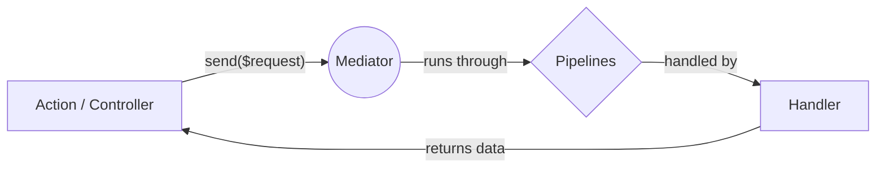
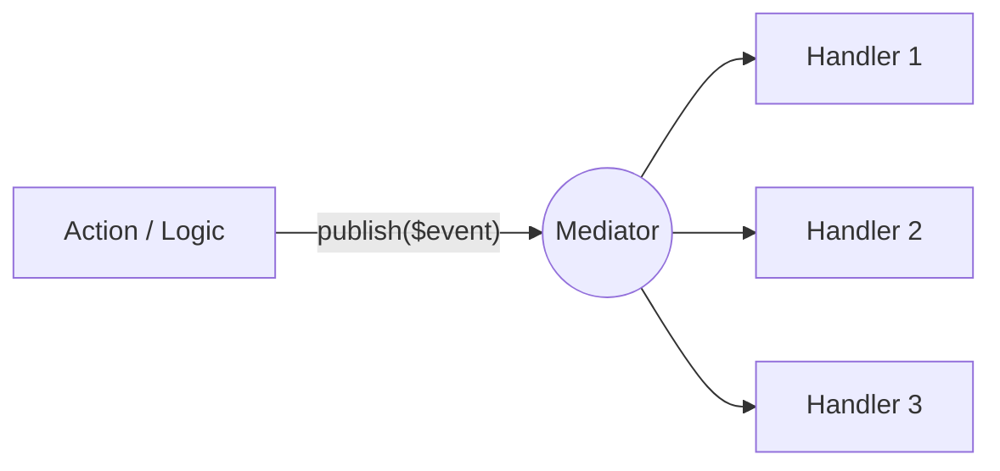

[](https://github.com/ignaciocastro0713/cqbus-mediator/actions/workflows/run-tests.yml)
[](https://github.com/ignaciocastro0713/cqbus-mediator/actions/workflows/php-cs-fixer.yml)
[](https://github.com/ignaciocastro0713/cqbus-mediator/actions/workflows/phpstan.yml)
[](https://codecov.io/gh/ignaciocastro0713/cqbus-mediator)
<a href="https://packagist.org/packages/ignaciocastro0713/cqbus-mediator" target="_blank"></a>
<a href="https://packagist.org/packages/ignaciocastro0713/cqbus-mediator" target="_blank"></a>
<a href="https://packagist.org/packages/ignaciocastro0713/cqbus-mediator" target="_blank"></a>

**CQBus Mediator** is a lightweight, zero-configuration Command/Query Bus for Laravel. It simplifies your application architecture by decoupling controllers from business logic using the Mediator pattern (CQRS).

---

## 📑 Table of Contents
- [✨ Why use this package?](#-why-use-this-package)
- [🚀 Installation](#-installation)
- [🧠 Core Concepts](#-core-concepts)
- [⚡ Quick Start (Command/Query)](#-quick-start-commandquery)
- [📢 Event Bus (Publish/Subscribe)](#-event-bus-publishsubscribe)
- [🎮 Routing & Actions](#-routing--actions)
- [🔗 Pipelines (Middleware)](#-pipelines-middleware)
- [📋 Console Commands](#-console-commands)
- [🚀 Production & Performance](#-production--performance)
- [🛠️ Development](#️-development)

---

## ✨ Why use this package?

- **⚡ Zero Config**: Automatically discovers Handlers and Events using PHP Attributes (`#[RequestHandler]`, `#[EventHandler]`).
- **📢 Dual Pattern Support**: Seamlessly handle both **Command/Query** (one-to-one) and **Event Bus** (one-to-many) patterns.
- **🛠️ Scaffolding**: Artisan commands to generate Requests, Handlers, Events, and Actions instantly.
- **🔗 Flexible Pipelines**: Apply middleware-like logic globally or specifically to handlers using the `#[Pipeline]` attribute.
- **🎮 Attribute Routing**: Manage routes, prefixes, and middleware directly in your Action classes—no more bloated route files.
- **🚀 Production Ready**: Includes a high-performance cache system that eliminates discovery overhead in production.
- **🔌 Container Native**: Everything is resolved through the Laravel Container, supporting full Dependency Injection.

---

## 🚀 Installation

Install via Composer:

```bash
composer require ignaciocastro0713/cqbus-mediator
```

The package is auto-discovered. You can optionally publish the config file:

```bash
php artisan vendor:publish --tag=mediator-config
```

> **Tip:** If you use a custom architecture like DDD (e.g., a `src/` or `Domain/` folder instead of `app/`), you can tell the Mediator where to discover your handlers by updating the `handler_paths` array in the published `config/mediator.php`.

---

## 🧠 Core Concepts

This package supports two main architectural patterns out of the box. Understanding how data flows through them is key.

### 1. Command / Query Pattern (1-to-1)
Use `send()` to dispatch a Request (Command or Query) to exactly **one** Handler. Perfect for creating records, fetching data, or executing specific business actions.



### 2. Event Bus Pattern (1-to-N)
Use `publish()` to broadcast an Event to **multiple** Event Handlers. Ideal for reacting to side effects (e.g., sending welcome emails or logging after a user registers).



---

## ⚡ Quick Start (Command/Query)

Let's implement a standard Command pattern where one request is handled by one specific handler.

### 1. Scaffold your Logic
Stop writing boilerplate. Generate a Request, Handler, and Action in one command:

```bash
php artisan make:mediator-handler RegisterUserHandler --action
```
*This creates:*
- `app/Http/Handlers/RegisterUser/RegisterUserRequest.php`
- `app/Http/Handlers/RegisterUser/RegisterUserHandler.php`
- `app/Http/Handlers/RegisterUser/RegisterUserAction.php`

### 2. Define the Request
The Request class is a standard Laravel `FormRequest` or a simple DTO.

```php
namespace App\Http\Handlers\RegisterUser;

use Illuminate\Foundation\Http\FormRequest;

class RegisterUserRequest extends FormRequest
{
    public function rules(): array
    {
        return ['email' => 'required|email', 'password' => 'required|min:8'];
    }
}
```

### 3. Write the Logic (Handler)
The handler contains your business logic. It's automatically linked to the Request via the `#[RequestHandler]` attribute.

```php
namespace App\Http\Handlers\RegisterUser;

use App\Models\User;
use Ignaciocastro0713\CqbusMediator\Attributes\RequestHandler;

#[RequestHandler(RegisterUserRequest::class)]
class RegisterUserHandler
{
    public function handle(RegisterUserRequest $request): User
    {
        // Business logic here
        return User::create($request->validated());
    }
}
```

---

## 📢 Event Bus (Publish/Subscribe)

In addition to the one-to-one Command/Query pattern, CQBus Mediator supports an **Event Bus** where multiple handlers can respond to a single event.

### 1. Scaffold your Event Logic
Generate an Event and its Handler in one command:

```bash
php artisan make:mediator-event-handler UserRegisteredHandler
```
*This creates:*
- `app/Http/Events/UserRegistered/UserRegisteredEvent.php`
- `app/Http/Events/UserRegistered/UserRegisteredHandler.php`

### 2. Define the Event
Events are simple PHP objects carrying data.

```php
namespace App\Http\Events\UserRegistered;

class UserRegisteredEvent
{
    public function __construct(
        public readonly string $userId,
        public readonly string $email
    ) {}
}
```

### 3. Create Event Handlers
Multiple handlers can respond to the same event. Use the `priority` parameter in the attribute to control execution order (higher = runs first). Priority defaults to 0.

```php
use Ignaciocastro0713\CqbusMediator\Attributes\EventHandler;
use App\Http\Events\UserRegistered\UserRegisteredEvent;

#[EventHandler(UserRegisteredEvent::class, priority: 3)]
class SendWelcomeEmailHandler
{
    public function handle(UserRegisteredEvent $event): void
    {
        Mail::to($event->email)->send(new WelcomeEmail());
    }
}

#[EventHandler(UserRegisteredEvent::class)]  // priority: 0 (default)
class LogUserRegistrationHandler
{
    public function handle(UserRegisteredEvent $event): void
    {
        Log::info("User registered: {$event->userId}");
    }
}
```

### 4. Publish the Event and Get Results
When you publish an event, all mapped handlers are executed. The `publish()` method returns an array of their return values keyed by the handler class name.

```php
$results = $this->mediator->publish(new UserRegisteredEvent($userId, $email));

// $results = [
//     SendWelcomeEmailHandler::class => null,
//     LogUserRegistrationHandler::class => true,
// ]
```

---

## 🎮 Routing & Actions

You can use the Mediator in two ways. We highly recommend the **Action Pattern** with our attribute routing.

### The "Action" Pattern (Recommended)
Use the generated `Action` class as a Single Action Controller. This keeps your routing logic self-contained and eliminates the need for external groups in `api.php` or `web.php`.

By using the `AsAction` trait, the package automatically discovers this class and registers the route for you during boot.

```php
use Ignaciocastro0713\CqbusMediator\Contracts\Mediator;
use Ignaciocastro0713\CqbusMediator\Traits\AsAction;
use Illuminate\Http\JsonResponse;
use Illuminate\Routing\Router;

class RegisterUserAction
{
    use AsAction;

    public function __construct(private readonly Mediator $mediator) {}

    // 🚀 Auto-registered! No need to add to routes/api.php
    public static function route(Router $router): void
    {
        $router->post('/api/register', static::class);
    }

    public function handle(RegisterUserRequest $request): JsonResponse
    {
        $user = $this->mediator->send($request);
        return response()->json($user, 201);
    }
}
```

### Advanced Action Routing: Attributes
You can easily apply prefixes and middleware directly on the Action class using PHP Attributes.

```php
use Ignaciocastro0713\CqbusMediator\Attributes\Middleware;
use Ignaciocastro0713\CqbusMediator\Attributes\Prefix;

#[Prefix('api/users')]
#[Middleware(['auth:sanctum'])]
class UpdateUserAction
{
    use AsAction;

    public static function route(Router $router): void
    {
        // Final Route: POST /api/users/{id}
        // Middleware: auth:sanctum
        $router->post('/{id}', static::class);
    }

    // ...
}
```

### Classic Controller Injection
If you prefer standard routing, simply omit the `route` method from your actions, or inject the `Mediator` interface into any standard controller.

```php
use Ignaciocastro0713\CqbusMediator\Contracts\Mediator;

class UserController extends Controller
{
    public function store(RegisterUserRequest $request, Mediator $mediator)
    {        
        $user = $mediator->send($request);
        return response()->json($user, 201);
    }
}
```

---

## 🔗 Pipelines (Middleware)

Pipelines allow you to wrap your Handlers in middleware-like logic. This is perfect for database transactions, logging, auditing, or caching.

### 1. Global Pipelines
Run before *every* handler dispatched via `send()`.

1. **Create a Pipe:**
   ```php
   class LoggingPipeline
   {
       public function handle($request, \Closure $next)
       {
           \Log::info('Processing: ' . get_class($request));
           return $next($request);
       }
   }
   ```
2. **Register in `config/mediator.php`:**
   ```php
   'pipelines' => [
       App\Pipelines\LoggingPipeline::class,
   ],
   ```

### 2. Handler-level Pipelines
Apply pipelines to specific handlers using the `#[Pipeline]` attribute.

```php
namespace App\Http\Handlers;

use Ignaciocastro0713\CqbusMediator\Attributes\Pipeline;
use Ignaciocastro0713\CqbusMediator\Attributes\RequestHandler;

#[RequestHandler(CreateOrderRequest::class)]
#[Pipeline(TransactionPipeline::class)] // Custom DB Transaction pipe
class CreateOrderHandler
{
    public function handle(CreateOrderRequest $request): Order
    {
        // This code runs inside a database transaction
        $order = Order::create($request->validated());
        $order->items()->createMany($request->items);
        
        return $order;
    }
}
```

*You can also pass an array of pipelines: `#[Pipeline([TransactionPipeline::class, AuditPipeline::class])]`. They execute in order: Global Pipelines → Handler Pipelines → Handler.*

### 3. Skipping Global Pipelines
Sometimes you need certain handlers to bypass global pipelines entirely (e.g., health checks). Use the `#[SkipGlobalPipelines]` attribute:

```php
use Ignaciocastro0713\CqbusMediator\Attributes\SkipGlobalPipelines;

#[RequestHandler(HealthCheckRequest::class)]
#[SkipGlobalPipelines]
class HealthCheckHandler
{
    // ...
}
```

---

## 📋 Console Commands

Use the `mediator:list` command to view all registered handlers, event handlers, and actions. This is helpful for debugging and understanding your application structure.

```bash
php artisan mediator:list
```

**Output:**
```
📦 Loading from cache: bootstrap/cache/mediator.php

  Handlers
+------------------------------------------+------------------------------------------+
| Request                                  | Handler                                  |
+------------------------------------------+------------------------------------------+
| App\Http\Handlers\RegisterUserRequest    | App\Http\Handlers\RegisterUserHandler    |
| App\Http\Handlers\CreateOrderRequest     | App\Http\Handlers\CreateOrderHandler     |
+------------------------------------------+------------------------------------------+

  Event Handlers
+------------------------------------------+------------------------------------------+----------+
| Event                                    | Handler                                  | Priority |
+------------------------------------------+------------------------------------------+----------+
| App\Http\Events\UserRegisteredEvent      | App\Http\Events\SendWelcomeEmailHandler  | 3        |
| App\Http\Events\UserRegisteredEvent      | App\Http\Events\LogUserRegistrationHandler| 0        |
+------------------------------------------+------------------------------------------+----------+
...
```

**Filters available:** `--handlers`, `--events`, `--actions`.

---

## 🚀 Production & Performance

Scanning files for Attributes is fast in development, but for **maximum performance in production**, you should cache the discovery results.

**Add this to your deployment script:**

```bash
# 1. Clear old cache
php artisan mediator:clear

# 2. Cache Handlers and Actions
php artisan mediator:cache
```

This creates a `bootstrap/cache/mediator.php` file. The package will load this map instantly instead of scanning your directories.

> **Note:** The `ActionDecorator` automatically respects `php artisan route:cache`. If your routes are cached, no discovery overhead occurs during booting.

### Benchmarks

Using the built-in caching mechanism, discovery overhead is virtually eliminated.

| Benchmark | Mode (Time) | Memory | Note |
|:----------|:-----------:|:-------|:-----|
| **Handler Discovery (Source)** | ~43.20 ms | 4.67 MB | Scanning files from disk |
| **Handler Discovery (Cached)** | **~0.07 ms** | 4.65 MB | **~600x faster!** |
| **Mediator Dispatch (Simple)** | ~0.08 ms | 13.34 MB | Total overhead per request |
| **Mediator Dispatch (Pipelines)** | ~0.31 ms | 13.34 MB | Dispatch with 2nd level pipelines |
| **Event Publish (3 Handlers)** | ~0.29 ms | 13.34 MB | Dispatching to multiple listeners |

*Results obtained on local development environment (PHP 8.2).*

---

## 🛠️ Development

### Requirements
- PHP 8.2+
- Composer

### Setup & Testing
```bash
git clone https://github.com/IgnacioCastro0713/cqbus-mediator.git
cd cqbus-mediator
composer install

# Run tests
composer test
composer test:coverage

# Static Analysis
composer analyse

# Code Styling
composer format
```

### 🤝 Contributing
Feel free to open issues or submit pull requests on the [GitHub repository](https://github.com/IgnacioCastro0713/cqbus-mediator).

## 📄 License
This package is open-sourced software licensed under the MIT license.
