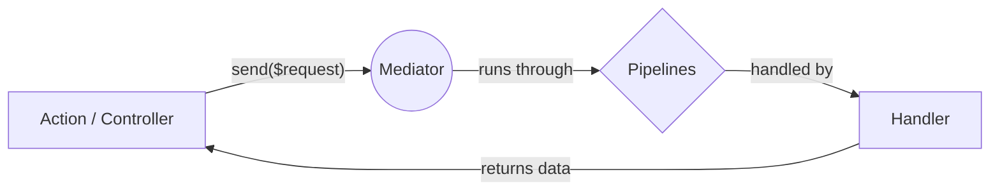

# Command / Query Pattern (1-to-1)

Use `send()` to dispatch a Request (Command or Query) to exactly **one** Handler.



## Quick Start

### 1. Scaffold your Logic
Stop writing boilerplate. Generate a Request, Handler, and Action in one command:

```bash
php artisan make:mediator-handler RegisterUserHandler --action
```
*This creates:*
- `app/Http/Handlers/RegisterUser/RegisterUserRequest.php`
- `app/Http/Handlers/RegisterUser/RegisterUserHandler.php`
- `app/Http/Handlers/RegisterUser/RegisterUserAction.php`

> **Note:** If you only need an Action (without a separate Handler), you can use:
> `php artisan make:mediator-action RegisterUserAction`

### 2. Define the Request
The Request class is a standard Laravel `FormRequest` or a simple DTO.

```php
namespace App\Http\Handlers\RegisterUser;

use Illuminate\Foundation\Http\FormRequest;

class RegisterUserRequest extends FormRequest
{
    public function rules(): array
    {
        return [
            'email' => 'required|email', 
            'password' => 'required|min:8'
        ];
    }
}
```

### 3. Write the Logic (Handler)
The handler contains your business logic. It is automatically linked to the Request via the `#[RequestHandler]` attribute. The framework discovers it automatically—no manual registration required.

```php
namespace App\Http\Handlers\RegisterUser;

use App\Models\User;
use Ignaciocastro0713\CqbusMediator\Attributes\RequestHandler;

#[RequestHandler(RegisterUserRequest::class)]
class RegisterUserHandler
{
    public function handle(RegisterUserRequest $request): User
    {
        return User::create($request->validated());
    }
}
```

### 4. Dispatch the Request
From anywhere in your application (like a Controller or an Action), type-hint the `Mediator` contract and use the `send` method:

```php
use Ignaciocastro0713\CqbusMediator\Contracts\Mediator;

public function __construct(private readonly Mediator $mediator) {}

public function register(RegisterUserRequest $request)
{
    // Executes the handler and returns the User
    $user = $this->mediator->send($request); 

    return response()->json($user);
}
```