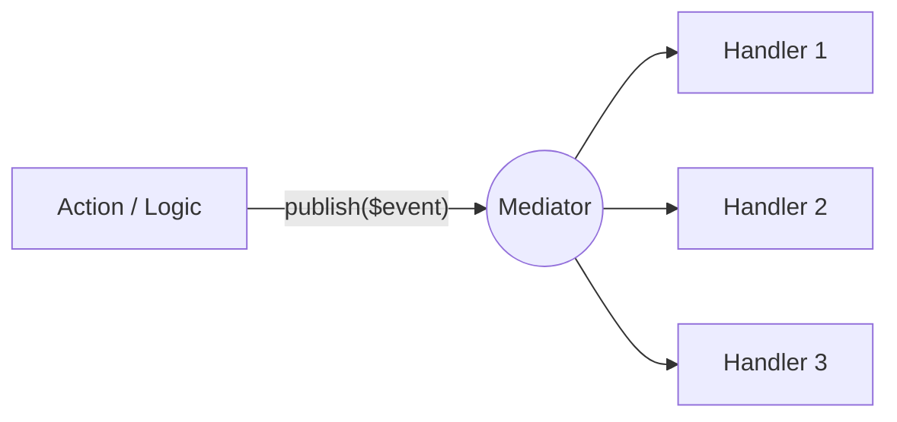

# Event Bus (Publish/Subscribe)

Multiple handlers can respond to the same event simultaneously. This is the **1-to-N** pattern.



## Creating an Event and Handlers

### 1. Scaffold your Event Logic
We provide a dedicated command to scaffold an Event and its initial Handler:

```bash
php artisan make:mediator-event-handler UserRegisteredHandler
```

### 2. Create Event Handlers
Use the `#[EventHandler]` attribute to link a handler to a specific Event class. 

You can use the `priority` parameter to control the execution order (higher numbers run first). The default priority is `0`.

```php
use Ignaciocastro0713\CqbusMediator\Attributes\EventHandler;
use App\Http\Events\UserRegistered\UserRegisteredEvent;

// Priority 3: Runs before LogUserRegistrationHandler
#[EventHandler(UserRegisteredEvent::class, priority: 3)]
class SendWelcomeEmailHandler
{
    public function handle(UserRegisteredEvent $event): void
    {
        Mail::to($event->email)->send(new WelcomeEmail());
    }
}

// Default Priority (0)
#[EventHandler(UserRegisteredEvent::class)]
class LogUserRegistrationHandler
{
    public function handle(UserRegisteredEvent $event): void
    {
        Log::info("User registered: {$event->userId}");
    }
}
```

### 3. Publish and Get Results
To publish an event, use the `publish()` method on the Mediator instance.

It returns an array of return values keyed by the handler class name, allowing you to see what each handler returned (if anything).

```php
use Ignaciocastro0713\CqbusMediator\Contracts\Mediator;

public function __construct(private readonly Mediator $mediator) {}

public function registerUser() 
{
    $userId = 1;
    $email = 'test@example.com';

    // The event is sent to all registered handlers based on their priority
    $results = $this->mediator->publish(new UserRegisteredEvent($userId, $email));
    
    // $results looks like:
    // [
    //    'App\Http\Events\SendWelcomeEmailHandler' => null,
    //    'App\Http\Events\LogUserRegistrationHandler' => null
    // ]
}
```