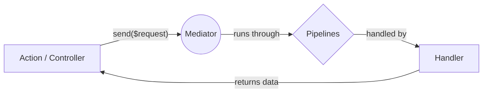

# Command / Query Pattern (1-to-1)

Use `send()` to dispatch a Request (Command or Query) to exactly **one** Handler.



## Quick Start

### 1. Scaffold your Logic
Stop writing boilerplate. Generate a Request, Handler, and Action in one command:

```bash
php artisan make:mediator-handler RegisterUserHandler --action
```

### 2. Implementation Example

Below is a complete example of how to implement a user registration flow using the Mediator pattern.

::: code-group

```php [RegisterUserRequest.php]
namespace App\Http\Handlers\RegisterUser;

use Illuminate\Foundation\Http\FormRequest;

class RegisterUserRequest extends FormRequest
{
    public function rules(): array
    {
        return [
            'email' => 'required|email', 
            'password' => 'required|min:8'
        ];
    }
}
```

```php [RegisterUserHandler.php]
namespace App\Http\Handlers\RegisterUser;

use App\Models\User;
use Ignaciocastro0713\CqbusMediator\Attributes\RequestHandler;

#[RequestHandler(RegisterUserRequest::class)]
class RegisterUserHandler
{
    public function handle(RegisterUserRequest $request): User
    {
        // Your business logic goes here
        return User::create($request->validated());
    }
}
```

```php [RegisterUserAction.php]
namespace App\Http\Actions;

use App\Http\Handlers\RegisterUser\RegisterUserRequest;
use Ignaciocastro0713\CqbusMediator\Attributes\ApiRoute;
use Ignaciocastro0713\CqbusMediator\Contracts\Mediator;
use Ignaciocastro0713\CqbusMediator\Traits\AsAction;
use Illuminate\Routing\Router;

#[ApiRoute]
class RegisterUserAction
{
    use AsAction;

    public function __construct(private readonly Mediator $mediator) {}

    public static function route(Router $router): void
    {
        $router->post('/register');
    }

    public function handle(RegisterUserRequest $request)
    {
        // Executes the handler and returns the User
        $user = $this->mediator->send($request); 

        return response()->json($user);
    }
}
```
:::