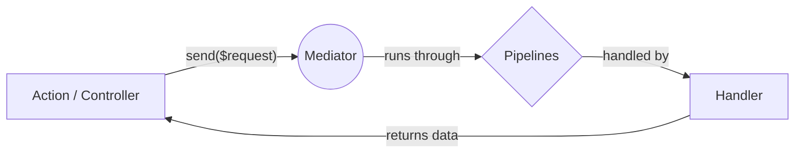
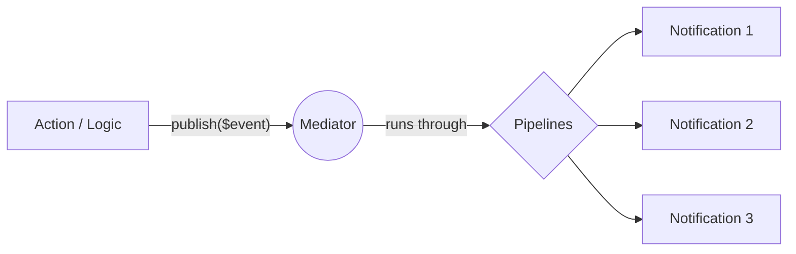

# Core Concepts

At the heart of this package is the `Mediator` service. Instead of components talking directly to each other, they send messages to the Mediator, which then routes them to the appropriate handlers. This results in a highly decoupled, easy-to-test architecture.

We support two distinct architectural patterns out of the box:

---

## 1. Command / Query Pattern (1-to-1)

Use this pattern when you want a specific action to happen and you expect a direct result. 

* **Commands:** Change the state of the system (e.g., `CreateUserRequest`, `ProcessPaymentRequest`).
* **Queries:** Ask the system for data without changing state (e.g., `GetUserProfileRequest`).

::: info 🔄 How it flows
1. You dispatch the request: `$mediator->send($request)`.
2. The Mediator pushes the request through any configured **Global and Request Pipelines** (like an onion).
3. The request hits its **dedicated Handler**, which executes your business logic.
4. The result is returned back to the caller.
:::

---

## 2. Event Bus Pattern (1-to-N)

Use this pattern for side-effects. When something significant happens in your system, you "announce" it. Other parts of your system can listen and react independently.

* **Events:** Represent something that already happened (e.g., `UserRegisteredEvent`, `OrderShippedEvent`).
* **Notifications:** The classes that respond to the event (e.g., `SendWelcomeEmailNotification`).

::: info 📢 How it flows
1. You broadcast the event: `$mediator->publish($event)`.
2. The Mediator pushes the event through any configured **Global and Notification Pipelines**.
3. The Mediator automatically discovers **all Notifications** subscribed to this event.
4. Notifications are executed sequentially based on their **priority** level.
5. The Mediator returns an array containing the responses of all executed notifications.
:::