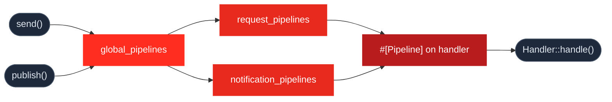

# Pipelines (Middleware)

## Execution Order



> `#[SkipGlobalPipelines]` bypasses `global_pipelines` and `*_pipelines`, keeping only handler-level `#[Pipeline]` attributes.

Pipelines allow you to wrap your Handlers in reusable logic. Think of them exactly like **Laravel Middleware**, but instead of operating at the HTTP layer, they operate directly at the Mediator layer. 

::: tip 💡 Why is this powerful?
Because pipelines run at the Mediator level, your logic (like Database Transactions or Auditing) will execute perfectly whether the handler was triggered by an HTTP Request, an Artisan Console Command, or a Queued Job!
:::

---

## 1. Global Pipelines

Global pipelines run before *every* handler dispatched via the `send()` or `publish()` method. This is the perfect place for global logging or APM (Application Performance Monitoring) tracking.

Register them in your `config/mediator.php` file:

```php
// config/mediator.php
return [
    'global_pipelines' => [
        \App\Pipelines\LoggingPipeline::class,
    ],
];
```

A pipeline is simply an invokable class that receives the payload and a `$next` Closure:

```php
namespace App\Pipelines;

use Closure;
use Illuminate\Support\Facades\Log;

class LoggingPipeline
{
    public function handle(mixed $payload, Closure $next): mixed
    {
        Log::info('Started executing: ' . get_class($payload));
        
        $response = $next($payload); // Move deeper into the onion
        
        Log::info('Finished executing successfully.');
        
        return $response;
    }
}
```

---

## 2. Segregated Pipelines

Sometimes you want pipelines that apply *only* to Requests, or *only* to Notifications. You can configure this easily in your `config/mediator.php`.

```php
// config/mediator.php
return [
    'global_pipelines' => [
        \App\Pipelines\LoggingPipeline::class, // Runs for EVERYTHING
    ],
    
    'request_pipelines' => [
        \App\Pipelines\DatabaseTransactionPipeline::class, // Runs ONLY for send()
    ],
    
    'notification_pipelines' => [
        \App\Pipelines\MetricsPipeline::class, // Runs ONLY for publish()
    ],
];
```

These type-specific pipelines run **after** the `global_pipelines` but **before** the handler-level pipelines.

---

## 3. Handler-Level Pipelines

Sometimes you only need a pipeline for specific actions. You can apply them directly to your handlers using the `#[Pipeline]` attribute. 

*Note: Handler-level pipelines run **after** Global and Type-specific pipelines.*

```php
use Ignaciocastro0713\CqbusMediator\Attributes\Pipelines\Pipeline;
use Ignaciocastro0713\CqbusMediator\Attributes\Handlers\RequestHandler;

#[RequestHandler(CreateOrderRequest::class)]
#[Pipeline(DatabaseTransactionPipeline::class)] // 🛡️ Ensures DB consistency
class CreateOrderHandler
{
    public function handle(CreateOrderRequest $request): Order
    {
        return Order::create($request->validated());
    }
}
```

---

## 4. Skipping Global Pipelines

What if you have a simple health-check query, and you don't want it to trigger your heavy Global Logging pipeline? Use the `#[SkipGlobalPipelines]` attribute.

*Note: When you use `#[SkipGlobalPipelines]`, it bypasses `global_pipelines`, `request_pipelines`, and `notification_pipelines`. Only handler-level `#[Pipeline]` attributes will run.*

```php
use Ignaciocastro0713\CqbusMediator\Attributes\Handlers\RequestHandler;
use Ignaciocastro0713\CqbusMediator\Attributes\Pipelines\SkipGlobalPipelines;

#[RequestHandler(HealthCheckRequest::class)]
#[SkipGlobalPipelines] // 🛑 Global and Type-Specific pipelines will be ignored
class HealthCheckHandler
{
    public function handle(HealthCheckRequest $request): string
    {
        return 'All systems operational.'; 
    }
}
```